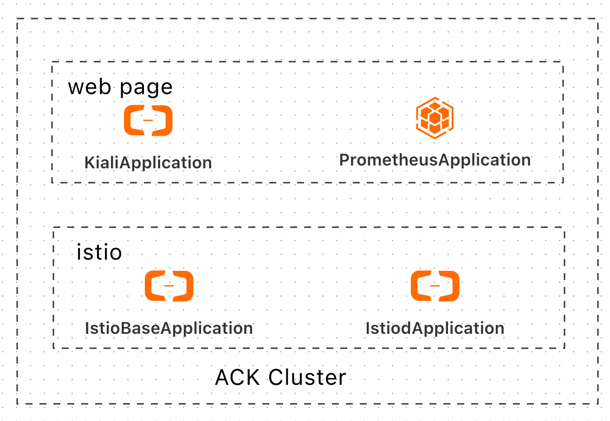
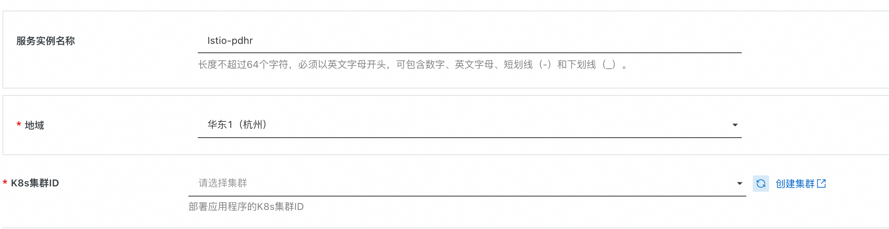
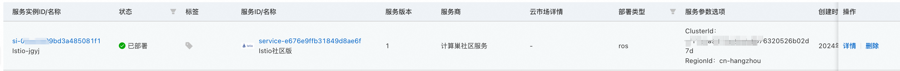
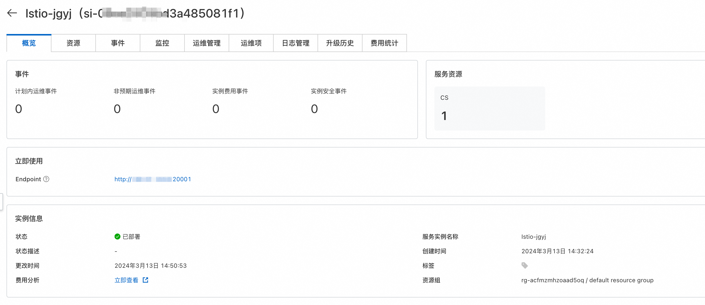
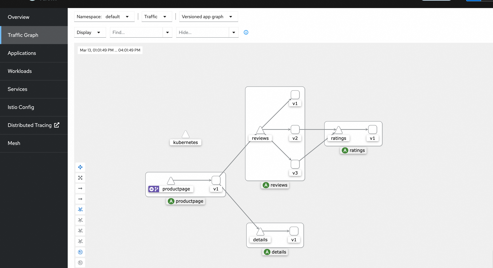

# Istio服务实例部署文档

## 概述

Istio是一个由 Google、IBM 和 Lyft 共同开发的开源服务网格（Service Mesh）项目，旨在简化微服务架构中的服务通信、安全性、可观察性和管理。通过部署 Istio，您可以更好地控制和监视服务之间的流量，并提供强大的安全功能。

官网地址见[链接](https://istio.io)。

## 计费说明
Istio部署的为社区开源版本，目前支持已有阿里云ACK集群进行部署，没有ACK集群的用户可以先去[ACK控制台](https://cs.console.aliyun.com/)进行创建，软件部署不收费，部署过程中创建的云资源需要付费。

Istio在计算巢上的费用主要涉及：

- 公网带宽费用

计费方式包括：

- 按流量计费
- 按固定带宽计费

## 部署架构
Istio服务为容器服务，部署在ack集群上，其中IstioBaseApplication和IstiodApplication负责Istio服务部署，KialiApplication和PrometheusApplication作为观测组件，用来展示Istio管理的微服务应用间互相调用情况。

## RAM账号所需权限
Istio服务需要进行ACK部署操作，若您使用RAM用户创建服务实例，需要在创建服务实例前，对使用的RAM用户的账号添加相应资源的权限。添加RAM权限的详细操作，请参见[为RAM用户授权](https://help.aliyun.com/document_detail/121945.html)。所需权限如下表所示。

| 权限策略名称                          | 备注                         |
|---------------------------------|----------------------------|
| AliyunROSFullAccess             | 管理资源编排服务（ROS）的权限           |
| AliyunComputeNestUserFullAccess | 管理计算巢服务（ComputeNest）的用户侧权限 |
| AliyunCSFullAccess              | 管理容器服务(CS)的权限              |

## 部署流程
### 部署步骤
您可以在阿里云计算巢自行搜索，也可以通过下述部署链接快速到达。

[部署链接](https://computenest.console.aliyun.com/service/instance/create/cn-hangzhou?type=user&ServiceId=service-e676e9ffb31849d8ae6f)
### 部署参数说明
您在创建服务实例的过程中，需要配置服务实例信息，下文介绍Istio服务实例输入参数的详细信息。

| 参数组       | 参数项       | 示例                              | 说明                           |
|-----------|-----------|---------------------------------|------------------------------|
| 服务实例名称    |           | Istio-test                            | 实例的名称                        |
| 地域        |           | 华东1（杭州）                         | 选中服务实例的地域，建议就近选中，以获取更好的网络延时。 |
| K8s集群ID  |        |  ccde6deb0f612402786e611a7e1230d  | 根据地域选择地域中用户已有的集群id           |

### 验证结果
1.查看服务实例，服务实例创建成功后，部署时间大约需要3分钟。部署完成后，页面上可以看到对应的服务实例。

2.点击详情，可以查看实例详情，具体页面如下，其中Endpoint为Istio服务对应的观测地址：

3.点击Endpoint，可以查看Istio服务观测网页，有具体的微服务应用部署，并产生调用后，可以通过调用图进行调用链路展示。下图是官方示例BookInfo应用的微服务调用情况。

